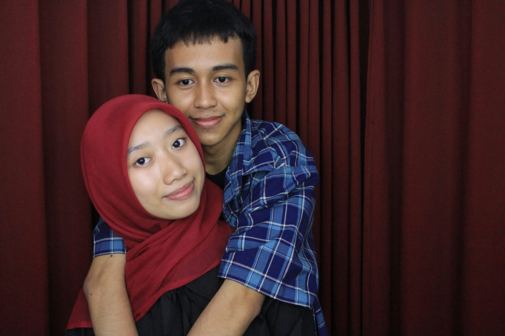
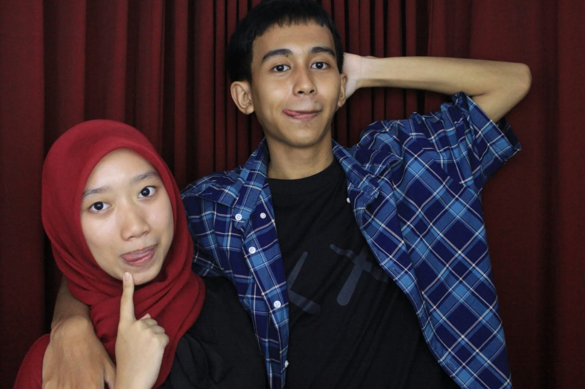
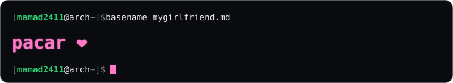

  

  

  

  

  
  

  
  

  

## Skills

**Languages**

  

**Frontend**

  

**Backend, Build & Testing**

  

**Databases**

  

**Cloud, Hosting & DevOps**

  

**Design & Productivity**

  

**Editors, OS & Terminal**

  

**Mobile**

  

**AI & Machine Learning**

  

**IoT & Embedded**

  

**Game Dev**

  

  

  <picture>
    <source media="(prefers-color-scheme: light)" srcset="https://www.gitskins.com/api/section/heatmap?username=mamad2411&theme=neon&style=terminal&mode=light" />
    
  </picture>

